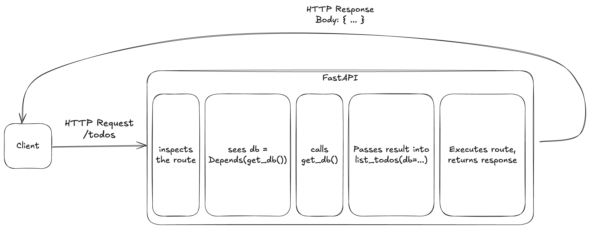

# Dependencies and Application Structure

COMPSCI 326, Web Programming

---

## Recap

- Request validation with **Pydantic**
- Reading error responses, improving robustness
- Built a Todo API with path, query, and body inputs

---

## Todays Goals

- Use **dependencies** to share logic across routes
- Structure the app for growth and testing
- Live refactor of the Todo API into a clean layout

---

## Why dependencies?

- DRY, avoid duplication of shared logic
- Centralize cross cutting concerns: DB, auth, config, logging
- Improve testability, easy to swap fakes and mocks
- Clear interfaces, function signatures declare what is required

---

## What `Depends()` does

* A parameter like `db = Depends(get_db)` tells FastAPI, resolve this first
* FastAPI calls the dependency function, injects the result into the route
* Works with sync and async functions, and nested dependencies
* Supports cleanup using `yield` in the dependency

```python
from fastapi import Depends

def get_db():
    return {"todos": []}

@app.get("/todos")
def list_todos(db = Depends(get_db)):
    return db["todos"]
```

---

## Dependency resolution, request flow



---

## Start flat → then improve (no folders yet)

```python
# main.py
from fastapi import FastAPI

app = FastAPI()
todos = []

@app.post("/todos")
def create_todo(item: str):
    todos.append(item)
    return {"todos": todos}

@app.get("/todos")
def list_todos():
    return todos
```

*Simple, but globals and tight coupling do not scale*

---

## Add a dependency, `get_db`

```python
from fastapi import FastAPI, Depends

app = FastAPI()
todos = []

def get_db():
    return {"todos": todos}

@app.get("/todos")
def list_todos(db = Depends(get_db)):
    return db["todos"]
```

*Routes ask for what they need, easier to swap implementations later*

---

## Add an auth dependency, `get_current_user`

```python
from fastapi import Depends

def get_current_user():
    # authentication stub
    return {"username": "alice"}

@app.get("/me")
def read_me(user = Depends(get_current_user)):
    return user
```

- No copy paste of auth logic, cleaner signatures

---

## Combine dependencies

```python
@app.get("/secure-todos")
def secure_todos(
    user = Depends(get_current_user),
    db = Depends(get_db),
):
    return {"user": user, "todos": db["todos"]}
```

- Many routes can share these without coupling

---

## Cleanup with `yield` dependencies

```python
# Example pattern for real DB sessions
from contextlib import contextmanager

def get_db():
    db = connect_to_database()  # e.g., ORM session
    try:
        yield db
    finally:
        db.close()
```

- FastAPI runs the `finally` block after the response is sent

---

## Why Structure Matters

- One file is fine for a tiny demo
- Larger apps need separation of concerns
- Benefits: readability, testing, scaling, collaboration

---

## Common project layout

```
app/
  main.py
  routers/
    todos.py
  models/
    todo.py
  dependencies/
    db.py
    auth.py
  services/
    todos.py
  config.py
```

* Routers hold endpoints, dependencies hold cross cutting logic
* Optional services layer for business logic

---

## Router example

```python
# app/routers/todos.py
from fastapi import APIRouter, Depends
from app.dependencies.db import get_db
from app.dependencies.auth import get_current_user

router = APIRouter(prefix="/todos", tags=["todos"])

@router.get("/")
def list_todos(db = Depends(get_db), user = Depends(get_current_user)):
    return {"user": user, "todos": db["todos"]}
```

---

## Mount routers in `main.py`

```python
# app/main.py
from fastapi import FastAPI
from app.routers import todos

app = FastAPI(title="Todo API", version="0.1.0")
app.include_router(todos.router)

# Optional, a root route
@app.get("/")
def root():
    return {"ok": True}
```

- Clear entry point, routers keep concerns focused

---

## Config as a Dependency 1

```python
# app/config.py
from pydantic import BaseModel

class Settings(BaseModel):
    app_name: str = "Todo API"
    debug: bool = True

def get_settings():
    return Settings()
```

* Later, swap to BaseSettings to pull from environment
* Use `Depends(get_settings)` in routes or other dependencies

---

## Config as a Dependency 2

```python
# use in a route
from app.config import get_settings
from fastapi import Depends

@app.get("/about")
def about(settings = Depends(get_settings)):
    return {"name": settings.app_name, "debug": settings.debug}
```

* Here, the route declares it needs config
* Easier to test with different settings
* Avoids global state

---

## Services Layer

```python
# app/services/todos.py
def list_all(db):
    return db["todos"]

# app/routers/todos.py
from app.services import todos as svc

@router.get("/")
def list_todos(db = Depends(get_db), user = Depends(get_current_user)):
    return {"user": user, "todos": svc.list_all(db)}
```

- Keeps business logic separate from HTTP concerns

---

## Live demo plan

1. Start from flat Todo app
2. Add `get_db` dependency
3. Add `get_current_user` dependency
4. Refactor into folders, move code into routers and dependencies
5. Mount routers in `main.py` and test

---

## Try it now, quick practice

- Add a `get_logger()` dependency that prints each path called
- Add a `get_settings()` dependency that reads a feature flag and echoes it
- Apply both to the `/secure-todos` route

---

## Wrap up

- Dependencies make code modular, reusable, and testable
- Structure supports scaling and collaboration
- Next time, connect to a real database using the same patterns

---

## References

- FastAPI documentation: https://fastapi.tiangolo.com/
- Pydantic documentation: https://docs.pydantic.dev/
- Uvicorn docs: https://www.uvicorn.org/
