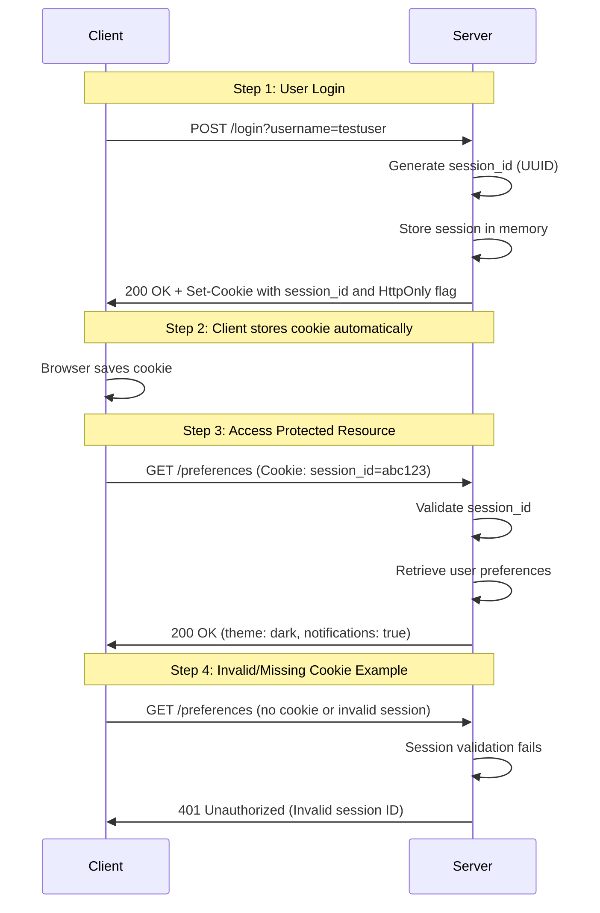

## 9. Cookie Example

```python
from fastapi import FastAPI, Cookie, HTTPException
from pydantic import BaseModel
from typing import Optional

app = FastAPI()

class UserPreferences(BaseModel):
    theme: Optional[str] = "light"
    notifications: Optional[bool] = True

@app.get("/preferences", response_model=UserPreferences)
def get_preferences(session_id: Optional[str] = Cookie(None)):
    if session_id == "abc123":
        return UserPreferences(theme="dark", notifications=False)
    elif session_id == "def456":
        return UserPreferences(theme="light", notifications=True)
    else:
        raise HTTPException(status_code=401, detail="Invalid session ID")
```

> NOTE: The example file `main.py` includes additional details for a complete working example. We also include `test_api.py` for testing the cookie functionality. Please study those files for a full implementation and understanding.

In this example, we define a FastAPI endpoint `/preferences` that reads a cookie named `session_id`. Depending on the value of this cookie, it returns different user preferences. If the cookie is missing or has an invalid value, it raises a 401 Unauthorized error.

### Cookie Authentication Flow



When a client makes a request to this endpoint with the appropriate cookie, they will receive a JSON response with their preferences. For example:

```http
GET /preferences HTTP/1.1
Host: example.com
Cookie: session_id=abc123
```

Response:

```json
{
    "theme": "dark",
    "notifications": false
}
```
