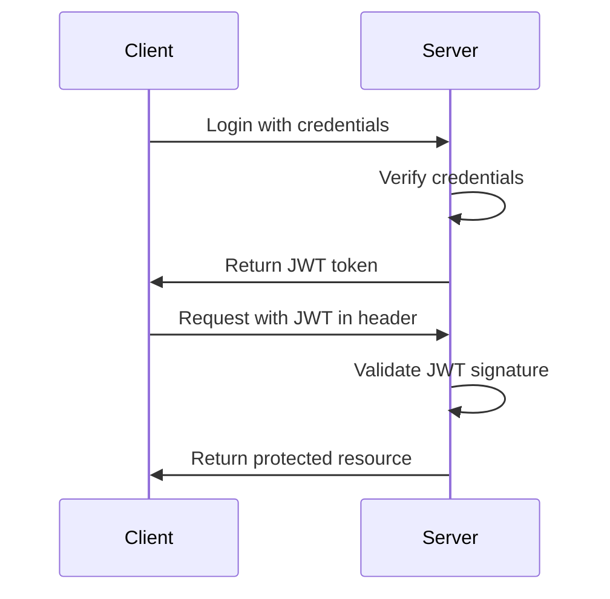

September 30, 2025 - Tim Richards

# COMPSCI 326 Web Programming

# Learning Objectives

- Understand how authentication differs from authorization
- Learn how to securely store passwords using hashing
- Set up token-based authentication with JWT in FastAPI
- Protect web endpoints from unauthorized access
- Implement a complete login system with user verification

**Code for this lecture:** 

[08-security-and-authentication.zip](attachment:cfe8636a-805a-4813-be59-07f45c242a01:08-security-and-authentication.zip)

**Next Lecture:** [L9 Authentication and Security 2](https://www.notion.so/L9-Authentication-and-Security-2-28062975977d803baf13fad1cfbeb020?pvs=21) 

---

# Authentication vs. Authorization

**Authentication (AuthN)**

- Verifies WHO you are
- Based on credentials (username/password, tokens, etc.)
- Comes BEFORE authorization
- Example: Logging into your email account

**Authorization (AuthZ)**

- Determines WHAT you can access
- Based on permissions and policies
- Happens AFTER authentication
- Example: Whether you can view admin dashboard

---

# Common Authentication Methods

- **Basic Authentication** - Username/password in HTTP headers (Base64 encoded)
- **Session-based** - Server stores session state, client stores session ID in cookie
- **Token-based** - Stateless, server issues token upon login (JWT, OAuth tokens)
- **OAuth 2.0** - Delegates authentication to third-party identity providers
- **Multi-Factor (MFA)** - Combines multiple authentication methods

***In this lecture, we'll focus on token-based authentication (JWT) because it's:***

- **Stateless** - no server-side session storage needed
- **Scalable** - works well across multiple servers
- Perfect for modern APIs and single-page applications

---

# Password Security Best Practices

**Never store plain text passwords!**

- Use cryptographic hashing algorithms
- Add salt to prevent rainbow table attacks
- Use algorithms designed for passwords:
- Bcrypt, Argon2, PBKDF2
- Avoid MD5, SHA1 (too fast)

---

# Password Hashing: Bad vs. Good

**Bad practice (NEVER do this):**

```python
# Storing plain text passwords is dangerous!
user_password = "secret123"
database.store(username, user_password)

```

**Good practice:**

```python
# Using bcrypt for secure password storage
import bcrypt

password = "secret123".encode()
salt = bcrypt.gensalt()
hashed = bcrypt.hashpw(password, salt)
database.store(username, hashed)

```

The bcrypt algorithm automatically includes the salt in the hash output, making it secure against rainbow table attacks.

---

# Common Web Security Vulnerabilities

- **Cross-Site Scripting (XSS)** - Injection of malicious scripts
- **Cross-Site Request Forgery (CSRF)** - Tricks user into unwanted actions
- **SQL Injection** - Manipulating database queries via input
- **Insecure Direct Object References** - Accessing unauthorized resources
- **Session Hijacking** - Stealing session identifiers
- **Security Misconfiguration** - Default settings, verbose errors

---

# Token-Based Authentication

**JSON Web Tokens (JWT)**

- Self-contained tokens with encoded information
- Three parts: Header, Payload, Signature
- Stateless - server doesn't need to store session data
- Can include claims about user identity and permissions

---

# JWT Authentication Flow



1. Client sends credentials to authenticate
2. Server validates credentials and generates a JWT
3. JWT is returned to client, who stores it (usually in localStorage)
4. Client includes the JWT in the Authorization header for subsequent requests
5. Server verifies the token's signature and extracts user information
6. If valid, server processes the request and returns data

---

# FastAPI Security Components

FastAPI provides several tools for implementing authentication:

- **OAuth2PasswordBearer** - Token-based authentication flow
- **OAuth2PasswordRequestForm** - Form for username/password input
- **HTTPBearer** - For Bearer token extraction from headers
- **Depends** - Dependency injection to protect routes
- **Security utilities** - Hashing, JWT handling

---

# Basic Authentication Example: Setup

In the following slides, we'll build a complete authentication system using FastAPI with:

- User management
- Password hashing
- JWT token generation and validation
- Protected endpoints

First, let's look at the basic structure and imports we need:

---

# Basic Setup: Imports and Dependencies

```python
from fastapi import FastAPI, Depends, HTTPException, status
from fastapi.security import OAuth2PasswordBearer, OAuth2PasswordRequestForm
from pydantic import BaseModel

app = FastAPI()
oauth2_scheme = OAuth2PasswordBearer(tokenUrl="token")

```

**Key components:**

- **FastAPI** - The web framework we're using
- **Depends** - Dependency injection system to extract and validate tokens
- **OAuth2PasswordBearer** - Utility to handle OAuth2 password flow
- **OAuth2PasswordRequestForm** - Form for handling login credentials
- **BaseModel** - For creating data models with validation

---

# User Data Structure

```python
# Mock database for this example
fake_users_db = {
    "johndoe": {
        "username": "johndoe",
        "full_name": "John Doe",
        "email": "john@example.com",
        "hashed_password": "fakehashedsecret",
        "disabled": False,
    }
}

class User(BaseModel):
    username: str
    email: str = None
    full_name: str = None
    disabled: bool = None

```

**Explanation:**

- We create a mock database dictionary to store user information
- The **User** class defines the data structure for user objects
- Pydantic models automatically validate the data types
- The **disabled** field allows us to deactivate user accounts

---

# User Retrieval Function

```python
def get_user(db, username: str):
    if username in db:
        user_dict = db[username]
        return User(**user_dict)
    return None

```

**Purpose:** Retrieve a user from the database by username

**How it works:**

- Takes a database object and username as parameters
- Checks if the username exists in the database
- If found, converts the dictionary to a User object
- Returns None if user is not found

The ****user_dict** syntax unpacks the dictionary into keyword arguments for the User constructor.

---

# Initial Authentication Functions

Now let's look at some basic authentication helper functions:

```python
def fake_hash_password(password: str):
    return "fakehashed" + password

def fake_decode_token(token):
    # This doesn't provide real security!
    # In production, use proper JWT validation
    user = get_user(fake_users_db, token)
    return user

```

**Note:** These are simplified examples for demonstration purposes. In production:

- Use a proper password hashing library like bcrypt
- Implement proper JWT validation

We'll improve these functions in later slides.

---

# Current User Dependency

```python
async def get_current_user(token: str = Depends(oauth2_scheme)):
    user = fake_decode_token(token)
    if not user:
        raise HTTPException(
            status_code=status.HTTP_401_UNAUTHORIZED,
            detail="Invalid authentication credentials",
            headers={"WWW-Authenticate": "Bearer"},
        )
    return user

```

**Purpose:** Extract and validate the JWT token from the request

**How it works:**

- Uses OAuth2PasswordBearer to extract the token from the Authorization header
- Decodes the token to get the user information
- Raises an HTTP 401 exception if the token is invalid
- Returns the authenticated user if successful

---

# Active User Dependency

```python
async def get_current_active_user(current_user: User = Depends(get_current_user)):
    if current_user.disabled:
        raise HTTPException(status_code=400, detail="Inactive user")
    return current_user

```

**Purpose:** Check if the authenticated user is active

**How it works:**

- Depends on the get_current_user function to get the authenticated user
- Checks if the user's disabled flag is set to True
- Raises an HTTP 400 exception if the user is inactive
- Returns the active user if the check passes

This creates a chain of dependencies: token extraction → user authentication → activity check

---

# Login Endpoint

```python
@app.post("/token")
async def login(form_data: OAuth2PasswordRequestForm = Depends()):
    user_dict = fake_users_db.get(form_data.username)
    if not user_dict:
        raise HTTPException(status_code=400, detail="Incorrect username or password")
    
    user = User(**user_dict)
    hashed_password = fake_hash_password(form_data.password)
    if not hashed_password == user.hashed_password:
        raise HTTPException(status_code=400, detail="Incorrect username or password")
    
    return {"access_token": user.username, "token_type": "bearer"}

```

**Purpose:** Handle login requests and issue access tokens

**How it works:**

- Receives username and password from the form data
- Looks up the user in the database
- Verifies the password against the stored hash
- Returns a token if authentication is successful

---

# Protected Endpoint

```python
@app.get("/users/me")
async def read_users_me(current_user: User = Depends(get_current_active_user)):
    return current_user

```

**Purpose:** A protected endpoint that requires authentication

**How it works:**

- Uses the get_current_active_user dependency to ensure the request is authenticated
- Only proceeds if a valid token is provided and the user is active
- Returns the current user's information

This pattern can be applied to any endpoint that needs authentication.

---

# Improving Security: Password Hashing

Now let's improve our authentication system with proper password hashing:

```python
from passlib.context import CryptContext

pwd_context = CryptContext(schemes=["bcrypt"], deprecated="auto")

def verify_password(plain_password, hashed_password):
    return pwd_context.verify(plain_password, hashed_password)

def get_password_hash(password):
    return pwd_context.hash(password)

```

**Key improvements:**

- Using PassLib with Bcrypt for secure password hashing
- CryptContext manages multiple hashing schemes and migrations
- verify_password checks if a plain password matches a hash
- get_password_hash generates a secure hash from a password

📦 You need to install the library used: `pip install passlib[bcrypt]` 

📦 You need to install the library used: `pip install bcrypt<4.0.0` 

These are included in the `requirements.txt` file with the code for this lecture.

---

# Improved User Authentication

```python
def authenticate_user(fake_db, username: str, password: str):
    user = get_user(fake_db, username)
    if not user:
        return False
    if not verify_password(password, user.hashed_password):
        return False
    return user

```

**Purpose:** Authenticate a user with username and password

**How it works:**

- Retrieves the user from the database
- If user doesn't exist, returns False
- Verifies the provided password against the stored hash
- Returns the user object if authentication succeeds
- Returns False if password verification fails

---

# JWT Token Implementation: Setup

Now let's implement proper JWT token generation and validation:

```python
from datetime import datetime, timedelta
from jose import JWTError, jwt

# Keep this secret key secure in production!
SECRET_KEY = "09d25e094faa6ca2556c818166b7a9563b93f7099f6f0f4caa6cf63b88e8d3e7"
ALGORITHM = "HS256"
ACCESS_TOKEN_EXPIRE_MINUTES = 30

```

**Key components:**

- **SECRET_KEY** - Used to sign the JWT tokens (keep this secure!)
- **ALGORITHM** - The algorithm used for token signing (HS256 is common)
- **ACCESS_TOKEN_EXPIRE_MINUTES** - Token expiration time

📦 You need to install the library used: `pip install python-jose`

**Note:** In a production environment, store the SECRET_KEY in environment variables, not in your code.

---

# JWT Token Creation Function

```python
def create_access_token(data: dict, expires_delta: timedelta = None):
    to_encode = data.copy()
    if expires_delta:
        expire = datetime.utcnow() + expires_delta
    else:
        expire = datetime.utcnow() + timedelta(minutes=15)
    to_encode.update({"exp": expire})
    encoded_jwt = jwt.encode(to_encode, SECRET_KEY, algorithm=ALGORITHM)
    return encoded_jwt

```

**Purpose:** Generate a JWT access token

**How it works:**

- Takes a data dictionary (usually containing user info)
- Adds an expiration time ("exp" claim)
- Encodes and signs the token using the secret key
- Returns the encoded JWT string

The expiration claim ensures tokens have limited lifetime, enhancing security.

---

# Conclusion and Next Steps

Key concepts covered in this lecture:

- Authentication vs. Authorization distinction
- Password security best practices (hashing, salting)
- JWT-based authentication flow
- FastAPI security components and implementation

In L9 Authentication and Security 2 we'll build on these concepts with JWT token implementation, Python clients for authentication testing, and security best practices for production applications.

---

# Appendix

# A. Complete Authentication Code

```python
from datetime import datetime, timedelta
from typing import Optional

from fastapi import Depends, FastAPI, HTTPException, status
from fastapi.security import OAuth2PasswordBearer, OAuth2PasswordRequestForm
from jose import JWTError, jwt
from passlib.context import CryptContext
from pydantic import BaseModel

# Security configuration
SECRET_KEY = "09d25e094faa6ca2556c818166b7a9563b93f7099f6f0f4caa6cf63b88e8d3e7"
ALGORITHM = "HS256"
ACCESS_TOKEN_EXPIRE_MINUTES = 30

# Mock database
fake_users_db = {
    "johndoe": {
        "username": "johndoe",
        "full_name": "John Doe",
        "email": "john@example.com",
        "hashed_password": "$2b$12$ukiUCP.QeMZNdLHNYzL1sugG6AOdLFFoLOFVzeRllTEL.5sXOMxgq",
        "disabled": False,
    }
}

# Models
class Token(BaseModel):
    access_token: str
    token_type: str

class TokenData(BaseModel):
    username: Optional[str] = None

class User(BaseModel):
    username: str
    email: Optional[str] = None
    full_name: Optional[str] = None
    disabled: Optional[bool] = None

class UserInDB(User):
    hashed_password: str

# Password context
pwd_context = CryptContext(schemes=["bcrypt"], deprecated="auto")
oauth2_scheme = OAuth2PasswordBearer(tokenUrl="token")

app = FastAPI()

# Helper functions
def verify_password(plain_password, hashed_password):
    return pwd_context.verify(plain_password, hashed_password)

def get_password_hash(password):
    return pwd_context.hash(password)

def get_user(db, username: str):
    if username in db:
        user_dict = db[username]
        return UserInDB(**user_dict)
    return None

def authenticate_user(fake_db, username: str, password: str):
    user = get_user(fake_db, username)
    if not user:
        return False
    if not verify_password(password, user.hashed_password):
        return False
    return user

def create_access_token(data: dict, expires_delta: Optional[timedelta] = None):
    to_encode = data.copy()
    if expires_delta:
        expire = datetime.utcnow() + expires_delta
    else:
        expire = datetime.utcnow() + timedelta(minutes=15)
    to_encode.update({"exp": expire})
    encoded_jwt = jwt.encode(to_encode, SECRET_KEY, algorithm=ALGORITHM)
    return encoded_jwt

# Dependencies
async def get_current_user(token: str = Depends(oauth2_scheme)):
    credentials_exception = HTTPException(
        status_code=status.HTTP_401_UNAUTHORIZED,
        detail="Could not validate credentials",
        headers={"WWW-Authenticate": "Bearer"},
    )
    try:
        payload = jwt.decode(token, SECRET_KEY, algorithms=[ALGORITHM])
        username: str = payload.get("sub")
        if username is None:
            raise credentials_exception
        token_data = TokenData(username=username)
    except JWTError:
        raise credentials_exception
    user = get_user(fake_users_db, username=token_data.username)
    if user is None:
        raise credentials_exception
    return user

async def get_current_active_user(current_user: User = Depends(get_current_user)):
    if current_user.disabled:
        raise HTTPException(status_code=400, detail="Inactive user")
    return current_user

# Routes
@app.post("/token", response_model=Token)
async def login_for_access_token(form_data: OAuth2PasswordRequestForm = Depends()):
    user = authenticate_user(fake_users_db, form_data.username, form_data.password)
    if not user:
        raise HTTPException(
            status_code=status.HTTP_401_UNAUTHORIZED,
            detail="Incorrect username or password",
            headers={"WWW-Authenticate": "Bearer"},
        )
    access_token_expires = timedelta(minutes=ACCESS_TOKEN_EXPIRE_MINUTES)
    access_token = create_access_token(
        data={"sub": user.username}, expires_delta=access_token_expires
    )
    return {"access_token": access_token, "token_type": "bearer"}

@app.get("/users/me", response_model=User)
async def read_users_me(current_user: User = Depends(get_current_active_user)):
    return current_user

@app.get("/users/me/items/")
async def read_own_items(current_user: User = Depends(get_current_active_user)):
    return [{"item_id": "Foo", "owner": current_user.username}]
```

# B. Complete Authentication Testing Client

```python
import requests
import json
from pprint import pprint

# API endpoint
BASE_URL = "http://localhost:8000"

def pretty_print_response(response):
    """Print the status code and response in a readable format"""
    print(f"Status code: {response.status_code}")
    try:
        pprint(response.json())
    except:
        print(response.text)
    print()

def get_token(username, password):
    """Get authentication token"""
    response = requests.post(
        f"{BASE_URL}/token",
        data={"username": username, "password": password}
    )
    return response

def get_user_info(token):
    """Get current user information"""
    headers = {"Authorization": f"Bearer {token}"}
    response = requests.get(f"{BASE_URL}/users/me", headers=headers)
    return response

def get_user_items(token):
    """Get items belonging to the authenticated user"""
    headers = {"Authorization": f"Bearer {token}"}
    response = requests.get(f"{BASE_URL}/users/me/items/", headers=headers)
    return response

def access_without_token():
    """Attempt to access protected endpoint without a token"""
    response = requests.get(f"{BASE_URL}/users/me")
    return response

def main():
    print("=== Authentication Demo ===")
    
    # Test successful authentication flow
    print("Attempting to get token...")
    response = get_token("johndoe", "secret")
    pretty_print_response(response)
    
    if response.status_code == 200:
        token_data = response.json()
        token = token_data["access_token"]
        
        print("Fetching user information...")
        user_response = get_user_info(token)
        pretty_print_response(user_response)
        
        print("Fetching user's items...")
        items_response = get_user_items(token)
        pretty_print_response(items_response)
    
    # Test invalid credentials
    print("=== Testing Invalid Authentication ===")
    print("Attempting to get token...")
    invalid_response = get_token("johndoe", "wrongpassword")
    pretty_print_response(invalid_response)
    
    if invalid_response.status_code == 401:
        print("Authentication failed as expected")
    
    # Test missing token
    print("=== Testing Missing Token ===")
    print("Attempting to access protected endpoint without token...")
    missing_token_response = access_without_token()
    pretty_print_response(missing_token_response)

if __name__ == "__main__":
    main()
```

**Code explanation:**

- Implements a Python client that tests all authentication endpoints
- Demonstrates successful login, retrieving a JWT token
- Shows how to make authenticated requests with the Bearer token
- Tests error scenarios (invalid credentials, missing token)
- Provides clear output formatting to see response status and content