### COMPSCI 326 Web Programming

October 2, 2025 - Tim Richards

Last Lecture: [L8 Authentication and Security 1](https://www.notion.so/L8-Authentication-and-Security-1-27e62975977d8086b1a5f7e830116e0d?pvs=21) 

---

# Learning Objectives

- Learn how to add login security to web apps using FastAPI
- Understand common web security problems and how to fix them
- Learn how to safely store passwords so they can't be stolen
- Set up token-based login systems for your web apps
- Compare different ways to handle user login for web applications

- **Lecture Material**
    
    [09-security-and-authentication-2.zip](attachment:bbaf0d3b-3a0b-46b0-8e9d-3f439a470310:09-security-and-authentication-2.zip)
    
    [JWT.IO - JSON Web Tokens Introduction](https://www.jwt.io/introduction#what-is-json-web-token)
    

---

# From Last Time

Key concepts covered in [L8 Authentication and Security 1](https://www.notion.so/L8-Authentication-and-Security-1-27e62975977d8086b1a5f7e830116e0d?pvs=21) :

- Authentication vs. Authorization distinction
- Password security best practices (hashing, salting)
- JWT-based authentication flow
- FastAPI security components and implementation

# Today

<aside>
✔️

Today, we'll build on these concepts with JWT token implementation, Python clients for authentication testing, and security best practices for production applications.

</aside>

---

# Diagrams Help Us Understand

Diagrams are powerful tools for understanding complex systems and relationships. They offer several key benefits:

- Visual representation of abstract concepts and relationships
- Simplification of complex systems into digestible components
- Clear illustration of process flows and dependencies
- Improved communication of technical concepts to diverse audiences
- Enhanced memory retention compared to text-only explanations
- Identification of patterns, bottlenecks, and optimization opportunities

---

# Diagram Types

To better understand the authentication and authorization code, we are going to look at a few diagrams up front.

- **Function and Data Structure Flow**
    - Function and data structure flow diagrams provide crucial visualization of how system components interact and relate to each other.
    - They reveal dependencies between functions, illustrate data movement paths, and highlight potential security vulnerabilities.
    - For developers, these diagrams simplify complex systems, aid in debugging, and serve as effective documentation for new team members joining the project.
- **Data Structure Relationships**
    
    Data structure relationship diagrams visually map connections between system components, offering several benefits:
    
    - Clarify complex data flows and dependencies
    - Identify potential security vulnerabilities
    - Provide clear documentation for team members
    - Help plan system modifications efficiently
- **Class Diagram**
    
    Class diagrams visually represent a system's **classes**, **attributes**, **methods**, and **relationships**. They:
    
    - Simplify complex object-oriented structures
    - Show inheritance relationships and encapsulation principles
    - Document system architecture for team understanding
    - Highlight data relationships crucial for security analysis
    - Support efficient system design and refactoring

---

# **Function and Data Structure Flow**


This is a diagram of the authentication and authorization code we began to look at in @[L8 Authentication and Security 1](https://www.notion.so/L8-Authentication-and-Security-1-27e62975977d8086b1a5f7e830116e0d?pvs=21). 

Key:

- Solid arrows indicate function dependencies (which functions call which)
- Dotted arrows show data usage (which functions work with which data structures)
- Color coding distinguishes between data structures (blue), helper functions (purple), route functions (green), and dependency functions (orange)

For additional explanation of this diagram:

[**Function and Data Structure Flow Diagram**](https://www.notion.so/Function-and-Data-Structure-Flow-Diagram-28062975977d801eb073dc847cc6bc67?pvs=21)

---

# **Data Model**


**Entity Relationship Diagram (ERD)** - Shows the data structure relationships:

- `fake_users_db` as the data source with all user fields
- Pydantic models: `Token`, `TokenData`, `User`, and `UserInDB`
- Relationships showing how data flows between models

To better understand this diagram, take a look at:

[**Entity Relationship Diagram (ERD)**](https://www.notion.so/Entity-Relationship-Diagram-ERD-28062975977d80cfb942d4b693e0ae44?pvs=21)

---

# **Class Diagram**


To better understand this diagram, take a look at:

[Class Diagram](https://www.notion.so/Class-Diagram-28062975977d80fd985ffb123ad11dd3?pvs=21)

**Pydantic Model Class Diagram** - Shows the object-oriented inheritance structure:

- All models inherit from Pydantic's `BaseModel`
- `UserInDB` extends `User` by adding the `hashed_password` field
- Clear separation between public API models and internal database models
- Notes explaining the purpose of each model

---

# Application Structure

Last class showed all of the functionality in a single file. The code example for today is structured like a real application.

```mermaid
graph TD
    %% Root Level
    ROOT[📁 FastAPI Authentication Demo]
    
    %% Main Files
    ROOT --> MAIN[📄 main.py<br/>Application Entry Point]
    ROOT --> README[📄 README.md<br/>Documentation]
    ROOT --> REQ[📄 requirements.txt<br/>Dependencies]
    ROOT --> CLIENT[📄 client.py<br/>Test Client]
    
    %% Main Directories
    ROOT --> APP[📁 app/<br/>Main Application Package]
    ROOT --> TESTS[📁 tests/<br/>Test Suite]
    ROOT --> DOCS[📁 docs/<br/>Documentation]
    ROOT --> DESIGN[📁 design/<br/>Design Documents]
    
    %% App Package Structure
    APP --> CORE[📁 app/core/<br/>Core Logic]
    APP --> MODELS[📁 app/models/<br/>Data Models]
    APP --> DB[📁 app/db/<br/>Database Layer]
    APP --> API[📁 app/api/<br/>API Routes]
    APP --> APP_INIT[📄 __init__.py<br/>Package Init]
    
    %% Core Module
    CORE --> CONFIG[📄 config.py<br/>Configuration & Settings]
    CORE --> AUTH[📄 auth.py<br/>Authentication & JWT]
    CORE --> DEPS[📄 dependencies.py<br/>FastAPI Dependencies]
    CORE --> CORE_INIT[📄 __init__.py<br/>Core Package Init]
    
    %% Models Module
    MODELS --> USER_MODEL[📄 user.py<br/>User Data Models]
    MODELS --> MODELS_INIT[📄 __init__.py<br/>Models Package Init]
    
    %% Database Module
    DB --> DATABASE[📄 database.py<br/>Database Operations]
    DB --> DB_INIT[📄 __init__.py<br/>DB Package Init]
    
    %% API Module
    API --> ROUTES[📄 routes.py<br/>API Endpoints]
    API --> API_INIT[📄 __init__.py<br/>API Package Init]
    
    %% Tests Structure
    TESTS --> TEST_AUTH[📄 test_auth.py<br/>Basic Auth Tests]
    TESTS --> TEST_COMPLETE[📄 test_complete.py<br/>Comprehensive Tests]
    TESTS --> TESTS_INIT[📄 __init__.py<br/>Tests Package Init]
    
    %% Design Structure
    DESIGN --> STRUCTURE_DIAGRAM[📄 project_structure.md<br/>This Diagram]
    
    %% Styling
    classDef rootStyle fill:#e1f5fe,stroke:#01579b,stroke-width:3px
    classDef folderStyle fill:#f3e5f5,stroke:#4a148c,stroke-width:2px
    classDef fileStyle fill:#e8f5e8,stroke:#1b5e20,stroke-width:1px
    classDef configStyle fill:#fff3e0,stroke:#e65100,stroke-width:2px
    classDef testStyle fill:#fce4ec,stroke:#880e4f,stroke-width:2px
    
    class ROOT rootStyle
    class APP,CORE,MODELS,DB,API,TESTS,DOCS,DESIGN folderStyle
    class MAIN,README,REQ,CLIENT,CONFIG,AUTH,DEPS,USER_MODEL,DATABASE,ROUTES fileStyle
    class APP_INIT,CORE_INIT,MODELS_INIT,DB_INIT,API_INIT,TESTS_INIT configStyle
    class TEST_AUTH,TEST_COMPLETE,STRUCTURE_DIAGRAM testStyle
```



# JWT Token Creation Function

```python
def create_access_token(data: dict, expires_delta: timedelta = None):
    to_encode = data.copy()
    if expires_delta:
        expire = datetime.utcnow() + expires_delta
    else:
        expire = datetime.utcnow() + timedelta(minutes=15)
    to_encode.update({"exp": expire})
    encoded_jwt = jwt.encode(to_encode, SECRET_KEY, algorithm=ALGORITHM)
    return encoded_jwt

```

**Purpose:** Generate a JWT access token

**How it works:**

- Takes a data dictionary (usually containing user info)
- Adds an expiration time ("exp" claim)
- Encodes and signs the token using the secret key
- Returns the encoded JWT string

The expiration claim ensures tokens have limited lifetime, enhancing security.

---

# Token Data Model

```python
class Token(BaseModel):
    access_token: str
    token_type: str

class TokenData(BaseModel):
    username: str = None

```

**Purpose:** Define the structure of tokens and token data

**Models:**

- **Token** - The response model for token endpoints
- **TokenData** - The data extracted from a validated token

These Pydantic models provide validation and clear type definitions.

---

# Updated Token Endpoint

```python
@app.post("/token", response_model=Token)
async def login_for_access_token(form_data: OAuth2PasswordRequestForm = Depends()):
    user = authenticate_user(fake_users_db, form_data.username, form_data.password)
    if not user:
        raise HTTPException(
            status_code=status.HTTP_401_UNAUTHORIZED,
            detail="Incorrect username or password",
            headers={"WWW-Authenticate": "Bearer"},
        )
    access_token_expires = timedelta(minutes=ACCESS_TOKEN_EXPIRE_MINUTES)
    access_token = create_access_token(
        data={"sub": user.username}, expires_delta=access_token_expires
    )
    return {"access_token": access_token, "token_type": "bearer"}

```

**Improvements:**

- Uses our authenticate_user function for proper password verification
- Creates a JWT with expiration time
- Stores the username in the "sub" (subject) claim
- Returns a proper Token object (validated by response_model)

---

# JWT Token Decoding

```python
async def get_current_user(token: str = Depends(oauth2_scheme)):
    credentials_exception = HTTPException(
        status_code=status.HTTP_401_UNAUTHORIZED,
        detail="Could not validate credentials",
        headers={"WWW-Authenticate": "Bearer"},
    )
    try:
        payload = jwt.decode(token, SECRET_KEY, algorithms=[ALGORITHM])
        username: str = payload.get("sub")
        if username is None:
            raise credentials_exception
        token_data = TokenData(username=username)
    except JWTError:
        raise credentials_exception
    user = get_user(fake_users_db, username=token_data.username)
    if user is None:
        raise credentials_exception
    return user

```

**Purpose:** Validate JWT token and extract user information

**How it works:**

- Decodes the JWT using the secret key
- Extracts the username from the "sub" claim
- Validates the token data structure
- Retrieves the user from the database
- Handles various error cases with appropriate exceptions

---

# Python Client for Authentication

**A Python script to interact with FastAPI's authentication endpoints:**

```python
import requests
import json
from pprint import pprint

# API base URL
BASE_URL = "http://localhost:8000"

def get_token(username, password):
    """
    Authenticate with the API and obtain an access token.
    
    Args:
        username: The user's username
        password: The user's password
        
    Returns:
        The access token if authentication succeeds, None otherwise
    """
    url = f"{BASE_URL}/token"
    data = {
        "username": username,
        "password": password
    }
    
    print("Attempting to get token...")
    response = requests.post(url, data=data)
    
    print(f"Status code: {response.status_code}")
    result = response.json()
    pprint(result)
    
    if response.status_code == 200:
        return result.get("access_token")
    return None

```

**Function explanation:**

- **get_token** sends a POST request to the /token endpoint with username and password
- Uses the `requests` library to handle HTTP communication
- Prints the status code and response for debugging
- Returns the token if successful (status 200) or None if failed

---

# Python Client: Accessing Protected Resources

```python
def get_current_user(token):
    """
    Get the current user's information using the provided token.
    
    Args:
        token: The JWT access token
        
    Returns:
        The user data if the token is valid, None otherwise
    """
    url = f"{BASE_URL}/users/me"
    headers = {
        "Authorization": f"Bearer {token}"
    }
    
    print("\nFetching user information...")
    response = requests.get(url, headers=headers)
    
    print(f"Status code: {response.status_code}")
    if response.status_code == 200:
        result = response.json()
        pprint(result)
        return result
    else:
        pprint(response.json())
        return None

```

**Function explanation:**

- **get_current_user** sends a GET request to the /users/me endpoint
- Includes the token in the Authorization header using Bearer scheme
- Prints the response data for inspection
- Returns the user data if successful or None if failed

---

# Python Client: Accessing Protected Items

```python
def get_user_items(token):
    """
    Get the current user's items using the provided token.
    
    Args:
        token: The JWT access token
        
    Returns:
        The user's items if the token is valid, None otherwise
    """
    url = f"{BASE_URL}/users/me/items/"
    headers = {
        "Authorization": f"Bearer {token}"
    }
    
    print("\nFetching user's items...")
    response = requests.get(url, headers=headers)
    
    print(f"Status code: {response.status_code}")
    if response.status_code == 200:
        result = response.json()
        pprint(result)
        return result
    else:
        pprint(response.json())
        return None

```

**Function explanation:**

- **get_user_items** sends a GET request to the /users/me/items/ endpoint
- Uses the same token-based authentication as get_current_user
- Demonstrates accessing a different protected resource
- Provides detailed output for debugging and understanding

---

# Python Client: Error Handling

```python
def invalid_authentication():
    """
    Demonstrate error responses with invalid credentials.
    """
    print("\n=== Testing Invalid Authentication ===")
    token = get_token("johndoe", "wrongpassword")
    
    if token is None:
        print("Authentication failed as expected")

def missing_token():
    """
    Demonstrate error when accessing protected resource without a token.
    """
    print("\n=== Testing Missing Token ===")
    url = f"{BASE_URL}/users/me"
    
    print("Attempting to access protected endpoint without token...")
    response = requests.get(url)
    
    print(f"Status code: {response.status_code}")
    pprint(response.json())

```

**Functions explanation:**

- **invalid_authentication** attempts to authenticate with incorrect credentials
- **missing_token** tries to access a protected endpoint without a token
- Both functions demonstrate how the API handles error cases
- Useful for understanding security behavior and debugging client issues

---

# Python Client: Main Execution

```python
def main():
    """
    Main function to demonstrate the authentication flow.
    """
    print("=== Authentication Demo ===")
    
    # Step 1: Get token with valid credentials
    token = get_token("johndoe", "secret")
    
    if token:
        # Step 2: Use token to get user information
        user = get_current_user(token)
        
        # Step 3: Get user's items
        items = get_user_items(token)
    else:
        print("Failed to obtain token, cannot proceed")
    
    # Demonstrate error cases
    invalid_authentication()
    missing_token()

if __name__ == "__main__":
    main()

```

**Complete script execution:**

- The **main** function orchestrates the entire authentication flow
- First authenticates with valid credentials to get a token
- Uses the token to access protected user data and items
- Demonstrates common error scenarios
- Shows the complete lifecycle of authentication and authorization

---

# Python Client: Sample Output

```
=== Authentication Demo ===
Attempting to get token...
Status code: 200
{'access_token': 'eyJhbGciOiJIUzI1NiIsInR5cCI6IkpXVCJ9...', 'token_type': 'bearer'}

Fetching user information...
Status code: 200
{'disabled': False,
 'email': 'john@example.com',
 'full_name': 'John Doe',
 'username': 'johndoe'}

Fetching user's items...
Status code: 200
[{'item_id': 'Foo', 'owner': 'johndoe'}]

=== Testing Invalid Authentication ===
Attempting to get token...
Status code: 401
{'detail': 'Incorrect username or password'}
Authentication failed as expected

=== Testing Missing Token ===
Attempting to access protected endpoint without token...
Status code: 401
{'detail': 'Not authenticated'}

```

**Output explanation:**

- Successful authentication returns a JWT token
- Protected endpoints return data when a valid token is provided
- Invalid credentials result in a 401 status with error details
- Missing token also produces a 401 status with appropriate message

---

# Authentication Flow Diagram


**The complete authentication flow:**

- Client authenticates to obtain a JWT token
- Client stores and uses the token for subsequent API requests
- Server validates the token for each protected endpoint
- Server returns appropriate data or error responses
- This pattern can be applied to any API requiring authentication

---

# Authentication Flow Diagram


This diagram illustrates the complete authentication flow in our FastAPI application:

- Client sends credentials to obtain a token
- Server authenticates and issues a JWT
- Client uses the JWT for subsequent requests
- Server validates the JWT and provides access to protected resources

---

# Security Best Practices

- **Always use HTTPS** - Encrypts data in transit
- **Use secure cookies** - HttpOnly, Secure, SameSite flags
- **Rate limiting** - Prevent brute force attacks
- **Validate all input** - Prevent injection attacks
- **Keep dependencies updated** - Fix known vulnerabilities
- **Content Security Policy (CSP)** - Mitigate XSS attacks
- **Security headers** - X-Content-Type-Options, X-Frame-Options
- **Principle of least privilege** - Limit permissions to what's needed

---

# Conclusion and Next Steps

**Things we've learned:**

- Authentication vs. Authorization concepts
- Securing passwords with proper hashing techniques
- Implementing token-based authentication with JWT
- Building a complete authentication system in FastAPI
- Security best practices to prevent common attacks

**Next steps: Data Persistence with SQLModel**

- Design a data model using SQLModel
- Implement CRUD operations using SQLModel
- Configure database connections in a FastAPI application
- Apply relationships between models (one-to-many, many-to-many)
- Integrate database operations with FastAPI endpoints