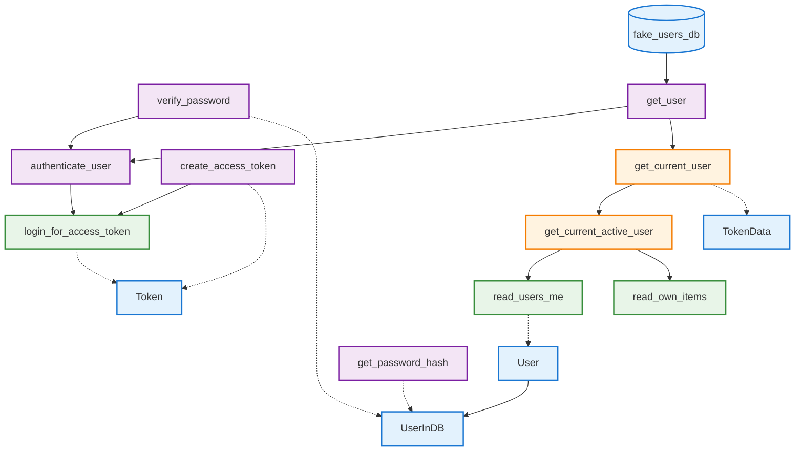
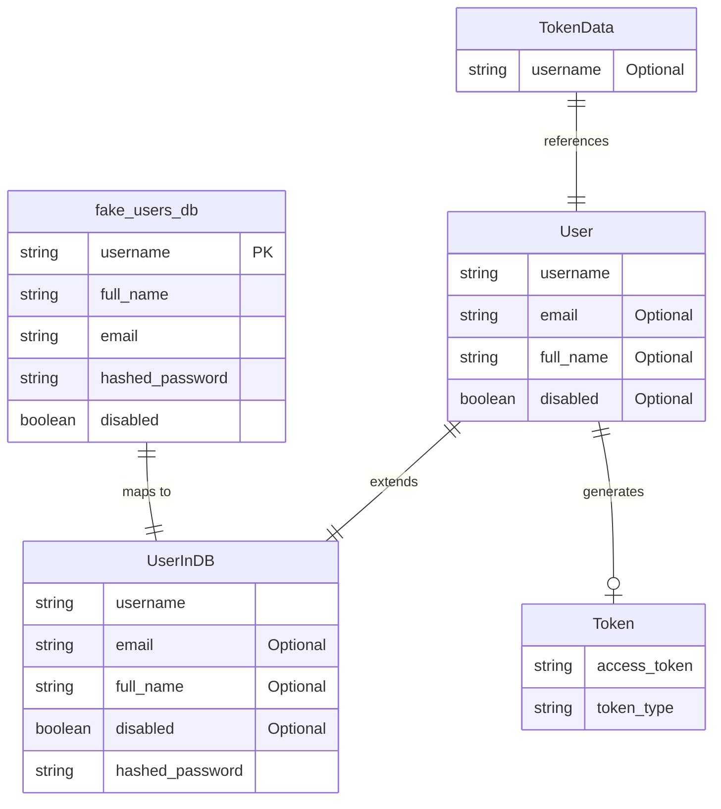
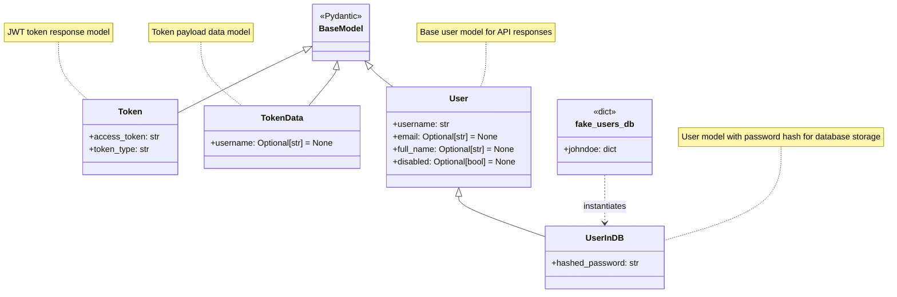

# FastAPI Authentication - Functions and Data Structures

To view these images, make sure you have the [Markdown Preview Mermaid Support](https://marketplace.visualstudio.com/items?itemName=bierner.markdown-mermaid) VS Code extension installed.

## Function and Data Structure Flow

## Data Model Diagram

## Pydantic Model Class Diagram

