# FastAPI Authentication Demo - Project Structure

This Mermaid diagram shows the complete project structure and organization of the FastAPI Authentication Demo application.

```mermaid
graph TD
    %% Root Level
    ROOT[📁 FastAPI Authentication Demo]
    
    %% Main Files
    ROOT --> MAIN[📄 main.py<br/>Application Entry Point]
    ROOT --> README[📄 README.md<br/>Documentation]
    ROOT --> REQ[📄 requirements.txt<br/>Dependencies]
    ROOT --> CLIENT[📄 client.py<br/>Test Client]
    
    %% Main Directories
    ROOT --> APP[📁 app/<br/>Main Application Package]
    ROOT --> TESTS[📁 tests/<br/>Test Suite]
    ROOT --> DOCS[📁 docs/<br/>Documentation]
    ROOT --> DESIGN[📁 design/<br/>Design Documents]
    
    %% App Package Structure
    APP --> CORE[📁 app/core/<br/>Core Logic]
    APP --> MODELS[📁 app/models/<br/>Data Models]
    APP --> DB[📁 app/db/<br/>Database Layer]
    APP --> API[📁 app/api/<br/>API Routes]
    APP --> APP_INIT[📄 __init__.py<br/>Package Init]
    
    %% Core Module
    CORE --> CONFIG[📄 config.py<br/>Configuration & Settings]
    CORE --> AUTH[📄 auth.py<br/>Authentication & JWT]
    CORE --> DEPS[📄 dependencies.py<br/>FastAPI Dependencies]
    CORE --> CORE_INIT[📄 __init__.py<br/>Core Package Init]
    
    %% Models Module
    MODELS --> USER_MODEL[📄 user.py<br/>User Data Models]
    MODELS --> MODELS_INIT[📄 __init__.py<br/>Models Package Init]
    
    %% Database Module
    DB --> DATABASE[📄 database.py<br/>Database Operations]
    DB --> DB_INIT[📄 __init__.py<br/>DB Package Init]
    
    %% API Module
    API --> ROUTES[📄 routes.py<br/>API Endpoints]
    API --> API_INIT[📄 __init__.py<br/>API Package Init]
    
    %% Tests Structure
    TESTS --> TEST_AUTH[📄 test_auth.py<br/>Basic Auth Tests]
    TESTS --> TEST_COMPLETE[📄 test_complete.py<br/>Comprehensive Tests]
    TESTS --> TESTS_INIT[📄 __init__.py<br/>Tests Package Init]
    
    %% Design Structure
    DESIGN --> STRUCTURE_DIAGRAM[📄 project_structure.md<br/>This Diagram]
    
    %% Styling
    classDef rootStyle fill:#e1f5fe,stroke:#01579b,stroke-width:3px
    classDef folderStyle fill:#f3e5f5,stroke:#4a148c,stroke-width:2px
    classDef fileStyle fill:#e8f5e8,stroke:#1b5e20,stroke-width:1px
    classDef configStyle fill:#fff3e0,stroke:#e65100,stroke-width:2px
    classDef testStyle fill:#fce4ec,stroke:#880e4f,stroke-width:2px
    
    class ROOT rootStyle
    class APP,CORE,MODELS,DB,API,TESTS,DOCS,DESIGN folderStyle
    class MAIN,README,REQ,CLIENT,CONFIG,AUTH,DEPS,USER_MODEL,DATABASE,ROUTES fileStyle
    class APP_INIT,CORE_INIT,MODELS_INIT,DB_INIT,API_INIT,TESTS_INIT configStyle
    class TEST_AUTH,TEST_COMPLETE,STRUCTURE_DIAGRAM testStyle
```

## Component Relationships

## Architecture Layers

```mermaid
graph TB
    %% Layer Definition
    subgraph "🌐 Presentation Layer"
        FASTAPI[FastAPI Application<br/>main.py]
        ROUTES_LAYER[API Routes<br/>app.api.routes]
    end
    
    subgraph "🔧 Business Logic Layer"
        AUTH_LAYER[Authentication<br/>app.core.auth]
        DEPS_LAYER[Dependencies<br/>app.core.dependencies]
        CONFIG_LAYER[Configuration<br/>app.core.config]
    end
    
    subgraph "📊 Data Access Layer"
        MODELS_LAYER[Data Models<br/>app.models.user]
        DB_LAYER[Database Ops<br/>app.db.database]
    end
    
    subgraph "🧪 Testing Layer"
        TEST_LAYER[Test Suite<br/>tests/]
    end
    
    %% Connections
    FASTAPI --> ROUTES_LAYER
    ROUTES_LAYER --> DEPS_LAYER
    DEPS_LAYER --> AUTH_LAYER
    AUTH_LAYER --> CONFIG_LAYER
    AUTH_LAYER --> DB_LAYER
    DB_LAYER --> MODELS_LAYER
    TEST_LAYER --> FASTAPI
    
    %% Styling
    classDef presentationStyle fill:#e3f2fd,stroke:#0277bd,stroke-width:2px
    classDef businessStyle fill:#e8f5e8,stroke:#2e7d32,stroke-width:2px
    classDef dataStyle fill:#fff3e0,stroke:#f57c00,stroke-width:2px
    classDef testStyle fill:#fce4ec,stroke:#c2185b,stroke-width:2px
    
    class FASTAPI,ROUTES_LAYER presentationStyle
    class AUTH_LAYER,DEPS_LAYER,CONFIG_LAYER businessStyle
    class MODELS_LAYER,DB_LAYER dataStyle
    class TEST_LAYER testStyle
```

