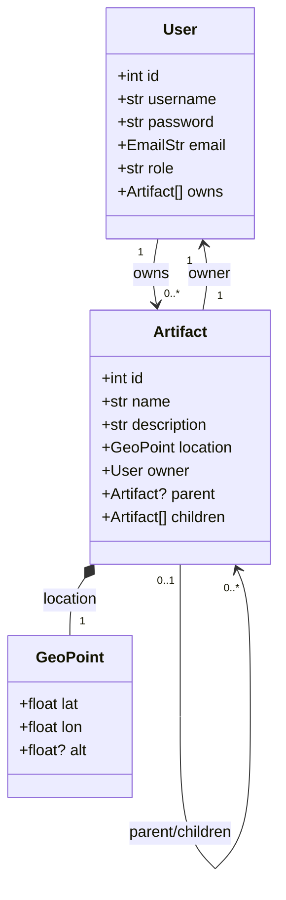

# LECTURE 12 Back-End Full

**DATE:** 10/14/2025
**Tim Richards**

---

At this point we have covered the complete picture of the back-end story of a full-stack web application. This includes how input and output happen in a web application using HTTP, how to create a web server using FastAPI, how to define endpoints and their parameters (e.g., path, query, body), how to validate requests and responses using Pydantic, how to authenticate and authorize users and their roles, the basics of relational databases and SQL, and how to use SQLModel as an ORM to interact with a database.

The next step is to put all of this together to really understand the complete picture. The best way to do this is to go step-by-step through the process of creating a complete back-end for an application. So, that is what we will do.

## Define the Application

This application is a simple one. It is a system for managing _artifacts_. An artifact is simply an item that has a **name**, **description**, **location**, and **owner**. A particular notebook may also contain other artifacts such as pictures and notes. The point is that artifacts can be nested within other artifacts and have associated properties. Naturally, artifacts may have additional properties that are specific to their type, but we are going to keep things relatively contained for demonstration purposes.

> The concept of an artifact is actually taken from a real-world project the instructor is working on with a team of students and is related to sustainability on campus. An artifact in that setting is a physical item or place on campus about or relating to sustainability. For example, a recycling bin is an artifact, as is a garden or a building that has sustainable features. The application being built here is a _very_ simplified version of the real-world application.

The functionality of the application is to allow users to create, read, update, and delete artifacts. Users can also add artifacts to other artifacts. For example, a notebook artifact can contain picture artifacts and note artifacts. We can also get a list of artifacts filtered by provided criteria. You could imagine all sorts of ways in which we could extend this application to manipulate artifacts in various ways, but we will refrain from doing so at the moment to keep things straight forward.

In addition to the fundamentals of the application, we also need to support registration, authentication, and authorization. Users must be able to register for an account, log in, and log out. Users must also be authorized to perform certain actions based on their role. For example, only the owner of an artifact can update or delete it.

## Project Setup

There are many ways to organize a project. However, because we are concerned right now with connecting the dots, we will keep things relatively simple. First, we are going to create a top-level directory for the project and go into that project:

```bash
mkdir artifact
cd artifact
```

Next, we will create the main entry point to the application. This is as much as we can do at the moment. Once we begin the design process, we will better understand our needs and can create additional directories and files as needed.

```bash
echo "# The main entry point to the application" > main.py
```

Now that we have that in place, we can move on to designing the data model. This will help us understand the entities in the system and how they relate to one another.

## Data Model Design

There are two important entities in this system: **User** and **Artifact**. A user has a username, password, email, and role. An artifact has a name, description, location, owner, and potentially other artifacts contained within it. The relationship between users and artifacts is that a user can own many artifacts, but an artifact has only one owner. The relationship between artifacts is that an artifact can contain many other artifacts, but an artifact can be contained in only one artifact. This creates a hierarchical structure of artifacts over which we need to define useful operations.

We will first draw a diagram to visualize the entities and their relationships. This is extremely helpful in understanding the data model and how to implement it using SQLModel. Although you might be tempted to jump right into coding, taking the time to design the data model will save you time and effort in the long run.



What are the **invariants** of this model?

1. Every artifact has exactly one owner.
2. An artifact has at most one parent artifact.
3. Root artifacts have no parent.
4. An Artifact can contain many child artifacts.
5. The structure forms a tree (i.e., no cycles).

This gives us a clean mental model of what the data structure looks like. Now, we can derive Pydantic schemas for the entities. We will need schemas for creating, reading, and updating users and artifacts. We will also need schemas for authentication and authorization.

> Note, we are using the word "schema" to differentiate between the Pydantic models we will use for validation and serialization and the SQLModel models we will use for the database. They are quite similar, but used for different purposes. As long as we have our mental model of the data structure, we can easily create both types of models.

## Data Model Implementation

To implement the above data model using Pydantic, we can start by creating the file:

```bash
echo "# Artifact Schemas" > schema.py
```

In the file we can being by implementing the `GeoPoint` schema. Just like the diagram suggests, we will include the latitude, longitude, and optional altitude. We also need not forget to import `BaseModel` from the `pydantic` library and `Optional` from the `typing` library for optional fields and `Field` from Pydantic for field constraints.

```python
from typing import Optional
from pydantic import BaseModel, Field

class GeoPoint(BaseModel):
    lat: float = Field(ge=-90, le=90)    # latitude must be between -90 and 90
    lon: float = Field(ge=-180, le=180)  # longitude must be between -180 and 180
    alt: Optional[float] = None
```

For a quick sanity check, we can create an instance of `GeoPoint` to ensure it works as expected. To do this, we can add the following code to the bottom of the `schema.py` file:

```python
if __name__ == "__main__":
    # Test the GeoPoint model
    point = GeoPoint(lat=37.7749, lon=-122.4194, alt=30)
    print(point)
    assert point.lat == 37.7749
    assert point.lon == -122.4194
    assert point.alt == 30
```

Running this file should print the `GeoPoint` instance and not raise any assertion errors. This is an example of what you might call a "smoke test". This is the output:

```bash
$ python schema.py
lat=37.7749 lon=-122.4194 alt=30.0
```

It never hurts to test even the simplest of things. Now that we have the `GeoPoint` schema, we can move on to the `User` and `Artifact` schemas. We will create separate schemas for input (creation and update) and output (responses) to match incoming request data without IDs and to avoid exposing sensitive information like passwords in API responses. First, we will outline the full Artifact schema, then we will break it down into input and output schemas.

### Starting With Artifact

```python
# Stub for User to avoid missing reference issues
class User(BaseModel):
    id: int


class Artifact(BaseModel):
    id: int
    name: str
    description: str
    location: GeoPoint
    owner: User
    parent: Optional[Artifact] = None
    children: List[Artifact] = Field(default_factory=list)
```

This is almost a direct translation from our diagram. However, we have a problem with the `owner` field because it references the `User` class, which we have not yet defined. So, we define a stub for the `User` class with just the `id` field to avoid forward reference issues. We will later replace this with a more complete definition.

We define the `children` field as a list of `Artifact` instances, using `Field(default_factory=list)` to ensure it defaults to an empty list if not provided. To ensure that our imports are correct, we need to add `List` from the `typing` library at the top of the file:

```python
from typing import Optional, List
```

Again, it is helpful to test this schema. We can add the following code to the bottom of the `schema.py` file after the `GeoPoint` test code:

```python
    artifact = Artifact(
        id=1,
        name="Sample Artifact",
        description="This is a sample artifact.",
        location=point,
        owner=User(id=1),
        parent=None,
        children=[],
    )
    print(artifact)
    assert artifact.id == 1
    assert artifact.name == "Sample Artifact"
    assert artifact.description == "This is a sample artifact."
    assert isinstance(artifact.location, GeoPoint)
    assert isinstance(artifact.owner, User)
    assert artifact.parent is None
    assert artifact.children == []
```

When we run the file again, we should see the `Artifact` instance printed without any assertion errors. But, we see something unexpected:

```bash
Traceback (most recent call last):
  File "/workspace/326/lectures/12-back-end-full/artifact/schema.py",
        line 19, in <module>
    class Artifact(BaseModel):
    ...<6 lines>...
        children: List[Artifact] = Field(default_factory=list)
  File "/workspace/326/lectures/12-back-end-full/artifact/schema.py",
        line 25, in Artifact
    parent: Optional[Artifact] = None
                     ^^^^^^^^
NameError: name 'Artifact' is not defined
```

The reason we see this error is that Python does not allow a type to reference itself directly in its own definition. To common fix to this is the import from `__future__` the `annotations` feature, which allows for postponed evaluation of type annotations. This means that the annotations are stored as strings and are not evaluated until later, which allows for forward references.

> Why doesn't Python handle forward references automatically? This is because Python is a dynamically typed language, and type annotations are not enforced at runtime. However, the type annotations are still evaluated when the class is defined, which can lead to issues with forward references. Type hints are primarily for static analysis and tooling, so Python does not prioritize handling forward references in the same way as statically typed languages. You can't have your cake and eat it too 😊🎂.

We can add this import at the very top of the `schema.py` file:

```python
from __future__ import annotations
```

When we run the file again, we should see the `Artifact` instance printed without any assertion errors:

```bash
$ python schema.py
lat=37.7749 lon=-122.4194 alt=30.0
id=1 name='Sample Artifact' description='This is a sample artifact.'
  location=GeoPoint(lat=37.7749, lon=-122.4194, alt=30.0)
  owner=User(id=1) parent=None children=[]
```

### Defining The User Schemas

Now we can move on to the definition of the User schemas. We will create separate schemas for input (creation and update) and output (responses) to match incoming request data without IDs and to avoid exposing sensitive information like passwords in API responses. Before we do that, however, we need to think more critically about the relationships between `User` and `Artifact`. The `User` schema has a list of owned artifacts, and the `Artifact` schema has an owner. This creates a circular reference that can lead to infinite recursion when serializing to JSON. To avoid this, we can create a summary schema for `Artifact` that only includes the essential fields needed to represent an artifact in the context of a user. This summary schema will be used in the `UserOut` schema to represent owned artifacts without causing recursion. Let's define the `ArtifactSummary` schema in `schema.py`:

```python
# An artifact summary for embedding in UserOut.
class ArtifactSummary(BaseModel):  # avoid cycles on UserOut
    id: int
    name: str = Field(min_length=1, max_length=100)
    location: GeoPoint
```

The `UserIn` schema is for matching and validating data coming in from a login request. An easy way to deal with usernames is to use email addresses. This way, we can leverage existing email validation libraries. Pydantic has built-in support for email validation through the `EmailStr` type. We also need to define a `Role` enum to represent user roles. We can use `StrEnum` from the `enum` library for this purpose. Let's add these definitions to `schema.py`. We will add this to the top of `schema.py` as they are shared definitions.

```python
# Role enum for the user roles.
class Role(StrEnum):
    admin = "admin"
    creator = "creator"
```

Make sure to add the necessary imports at the top of the file:

```python
from pydantic import (
    BaseModel,
    Field,
    EmailStr,
)
```

Now we can define the `UserIn` and `UserOut` schemas. The `UserIn` schema will include the username, password, email, and role. The `UserOut` schema will include the id, username, email, role, and a list of owned artifacts represented by the `ArtifactSummary` schema. Let's add these definitions to `schema.py`:

```python
class UserIn(BaseModel):  # for create or update
    username: EmailStr
    password: str = Field(min_length=12,
                          max_length=100,
                          pattern=r"^[!-~]+$")
    email: EmailStr
    role: Role


class UserOut(BaseModel):  # for responses
    id: int
    username: EmailStr
    email: EmailStr
    role: Role
    owns: list[ArtifactSummary] = Field(default_factory=list)
```

We are using `ArtifactSummary` in `UserOut` to avoid circular references. Think about it, if we used the full `Artifact` schema in `UserOut`, then each `Artifact` would have an `owner` field that references a `User`, which would have an `owns` field that references a list of `Artifact`, and so on, leading possibly to an infinite recursion scenario.

At this point, you should test to make sure your code is executable. Adding basic `assert` tests like we did for the previous schemas is a good idea. However, we will forego that for now to keep things moving.

### Refactoring The Artifact Schema

Although we have already created an `Artifact` schema that aligns with our diagram. We need to revise this to have it make sense with data input and output. So, we are going to delete the `Artifact` schema and replace it with `ArtifactIn` and `ArtifactOut` schemas. The `ArtifactIn` schema will be used for queries and updating artifacts, while the `ArtifactOut` schema will be used for responses. The `ArtifactIn` schema will not include the `id`, `owner`, or `children` fields, as these are either generated by the system or not needed for input. The `ArtifactOut` schema will include all fields except for `children`, which we will use the `ArtifactSummary` schema. Again, we are being careful to avoid circular references and keep the output manageable. We will also add an `ArtifactCreate` schema as its shape is slightly different than the others. In particular, when creating a new artifact, we do not have an id for it yet. Let's add these definitions to `schema.py`:

```python
class ArtifactCreate(BaseModel):
    name: str = Field(min_length=1, max_length=100)
    description: Optional[str] = Field(...,
                                       min_length=0,
                                       max_length=500)
    location: GeoPoint
    parent_id: Optional[int] = None

class ArtifactIn(BaseModel):
    id: int
    name: str = Field(min_length=1, max_length=100)
    description: Optional[str] = Field(...,
                                       min_length=0,
                                       max_length=500)
    location: GeoPoint
    owner_id: int
    parent_id: Optional[int] = None

class ArtifactOut(BaseModel):
    id: int
    name: str
    description: Optional[str] = Field(...,
                                       min_length=0,
                                       max_length=500)
    location: GeoPoint
    owner: UserOut
    parent_id: Optional[int] = None
    children: List[ArtifactSummary] = Field(default_factory=list)
```

The constraints to the fields in `ArtifactCreate` and `ArtifactIn` are designed to ensure that the data is valid and meets the requirements of the application. For example, the `name` field must be between 1 and 100 characters long, and the `description` field can be up to 500 characters long. The `owner_id` field is required to associate the artifact with a user, while the `parent_id` field is optional to allow for root artifacts.

## API Service Design

Now that we have put together a reasonable data model, we can move on to designing the API service. This involves defining the endpoints and their parameters, as well as the request and response schemas. We will also need to consider authentication and authorization for the endpoints. But, we will get to that later.

The basic requirements for the artifact management system are as follows:

- `POST /api/register`: Register a new user. Data in request body.
- `POST /api/login`: Log in a user. Data in request body.
- `POST /api/logout`: Log out the current user.
- `POST /api/artifact/create`: Create a new artifact. Data in request body.
- `GET /api/artifact/{id}`: Get an artifact by its ID.
- `GET /api/artifact`: Get all artifacts. Query parameter for filtering.
- `PUT /api/artifact/{id}`: Update artifact by ID. Data in request body.
- `DELETE /api/artifact/{id}`: Delete an artifact by ID.
- `POST /api/artifact/{id}/add/{oid}`: Add an artifact (by ID) to another artifact (by ID).

We will implement endpoints for creating and retrieving artifacts first. Then, we will move on to registration, authentication, and authorization. The remaining endpoints will be left as a homework exercise.

### Creating Artifacts

We want to get able to get data into the system. So, the first endpoint we will implement is the `POST /api/artifact` endpoint. This endpoint will allow us to create a new artifact. The request body will contain the data for the new artifact, and the response will contain the created artifact with its ID and owner information. The request type is `ArtifactCreate`, and the response type is `ArtifactOut`. We will also need to ensure that the user is authenticated and authorized to create artifacts. For now, we will assume that any user can create artifacts. We will implement authentication and authorization later.

```python
@app.post("/api/artifact/", response_model=ArtifactOut)
def create_artifact(artifact: ArtifactCreate):
    try:
        current_id = next_artifact_id()
        artifact_id = store_artifact_in_db(artifact, current_id)
        out = ArtifactOut(
            id=artifact_id,
            name=artifact.name,
            description=artifact.description,
            location=artifact.location,
            owner_id=get_current_user_id(),
            parent_id=artifact.parent_id,
            children=[],
        )

        return out
    except Exception as e:
        raise HTTPException(status_code=500, detail=str(e))

```

As you can see, we defined the endpoint exactly as we described it. The `create_artifact` function takes an `ArtifactCreate` object as input and returns an `ArtifactOut` object. We are using a try-except block to catch any exceptions that may occur during the process of creating the artifact. If an exception occurs, we raise an `HTTPException` with a status code of 500 and the exception message.

Also notice that we are using some helper functions that we have not yet defined. These are `next_artifact_id`, `store_artifact_in_db`, and `get_current_user_id`. Eventually, they will be implemented to interact with the database and manage user sessions. For now, we will define them as stubs that return dummy data. We will add these stubs to the top of the `main.py` file:

```python
def next_artifact_id():
    # Placeholder function to generate the next artifact ID
    return 1


def get_current_user_id():
    # Placeholder function to get the current user's ID
    return 1


def store_artifact_in_db(artifact: ArtifactCreate, owner_id: int) -> int:
    # Placeholder function to store the artifact in the database
    # and return the new artifact's ID
    return 1
```

In general, it is a good tactic to define stubs for functions that you will implement later. This allows you to focus on the overall structure of the application without getting bogged down in the details of each function. You can then come back and implement the details later.

### Retrieving Artifacts

Naturally, we will want to get artifacts out of the system. So, the next endpoint we will implement is the `GET /api/artifact/{id}` endpoint. This endpoint will allow us to retrieve an artifact by its ID. The response will contain the artifact with its ID and owner information. The response type is `ArtifactOut`. We will also need to ensure that the user is authenticated and authorized to view the artifact. For now, we will assume that any user can view any artifact. We will implement authentication and authorization later.

```python
@app.get("/api/artifact/{artifact_id}", response_model=ArtifactOut)
def get_artifact_by_id(artifact_id: int):
    try:
        artifact = find_artifact_in_db(artifact_id)
        return artifact
    except Exception as e:
        raise HTTPException(status_code=500, detail=str(e))
```

Again, we are using a try-except block to catch any exceptions that may occur during the process of retrieving the artifact. If an exception occurs, we raise an `HTTPException` with a status code of 500 and the exception message. We are also using a helper function that we have not yet defined. This is `find_artifact_in_db`. Eventually, it will be implemented to interact with the database and retrieve the artifact by its ID. For now, we will define it as a stub that returns dummy data. We will add this stub to the top of the `main.py` file:

```python
def find_artifact_in_db(artifact_id: int) -> ArtifactOut:
    # Placeholder function to find an artifact in the database by ID
    # and return it as an ArtifactOut object
    return ArtifactOut(
        id=artifact_id,
        name="Sample Artifact",
        description="This is a sample artifact.",
        location={"lat": 0.0, "lon": 0.0, "alt": 0.0},
        owner_id=1,
        parent_id=None,
        children=[],
    )
```

## Running The Application

To get the application up and running, we need to install the necessary dependencies. We will use `pip` to install `fastapi` and `uvicorn`. We can do this by running the following command in the terminal:

```bash
pip install fastapi uvicorn
```

Then we can add to the bottom of `main.py` the following code to run the application using `uvicorn`:

```python
if __name__ == "__main__":
    import uvicorn

    print("Running Artifact Management API on http://localhost:8000")
    uvicorn.run(app, host="0.0.0.0", port=8000)
```

To test these endspoints easily, we will write a simple `bash` script to run `curl` against our endpoints. We will create a file called `api_test.sh` in the top-level directory of the project:

```bash
#! /usr/bin/env bash

echo -e "POST /api/artifact/create"
curl -sS -X POST http://localhost:8000/api/artifact/create \
  -H "Content-Type: application/json" \
  -H "Authorization: Bearer <YOUR_TOKEN>" \
  -d '{
    "name": "Trail Camera",
    "description": "Solar powered, motion-activated camera",
    "location": { "lat": 42.391, "lon": -72.526, "alt": 92.5 },
    "parent_id": 0
  }' | jq

echo -e "\nPOST /api/artifact/create"
curl -sS -X POST http://localhost:8000/api/artifact/create \
  -H "Content-Type: application/json" \
  -H "Authorization: Bearer <YOUR_TOKEN>" \
  -d '{
    "name": "Spare Battery",
    "description": "Lithium pack for the trail cam",
    "location": { "lat": 42.392, "lon": -72.527 },
    "parent_id": 1
  }' | jq

echo -e "\nGET /api/artifact/1"
curl -sS "http://localhost:8000/api/artifact/1" \
  -H "Accept: application/json" \
  -H "Authorization: Bearer <YOUR_TOKEN>" | jq
```

If we run this script, we should see the output of the two created artifacts and the retrieved artifact. Note that we are using `jq` to format the JSON output for readability. First, we need to make the script executable:

```bash
chmod +x api_test.sh
```

Then we can run the script:

```bash
./api_test.sh
```

You should see output similar to the following:

```json
POST /api/artifact/create
{
  "id": 1,
  "name": "Trail Camera",
  "description": "Solar powered, motion-activated camera",
  "location": {
    "lat": 42.391,
    "lon": -72.526,
    "alt": 92.5
  },
  "owner_id": 1,
  "parent_id": 0,
  "children": []
}

POST /api/artifact/create
{
  "id": 1,
  "name": "Spare Battery",
  "description": "Lithium pack for the trail cam",
  "location": {
    "lat": 42.392,
    "lon": -72.527,
    "alt": null
  },
  "owner_id": 1,
  "parent_id": 1,
  "children": []
}

GET /api/artifact/1
{
  "id": 1,
  "name": "Sample Artifact",
  "description": "This is a sample artifact.",
  "location": {
    "lat": 0.0,
    "lon": 0.0,
    "alt": 0.0
  },
  "owner_id": 1,
  "parent_id": null,
  "children": []
}
```
